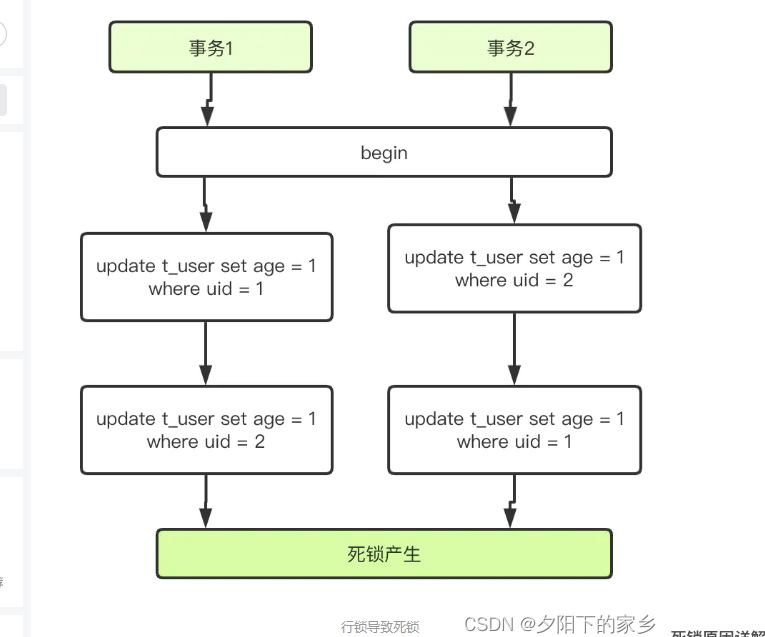

# mysql总结

- 1.什么是当前读、快照读
- 2.mvcc怎么实现的 rr rc的区别，能解决哪种情况的幻读
- 3.间隙锁锁的区间是什么，是互斥的吗
- 4.next-key lock能解决哪种情况的幻读，能解决所有情况的幻读吗
- 5.写一种出现死锁的情况
- 6.死锁如何能减少发生的概率，mysql提供了什么办法吗

- 1.聚簇索引/非聚簇索引，mysql索引底层实现，为什么不用B-tree，为什么不用hash，叶子结点存放的是数据还是指向数据的内存地址，
>
> 聚簇索引/非聚簇索引
在 InnoDB 里，索引B+ Tree的叶子节点存储了整行数据的是主键索引，也被称之为聚簇索引。而索引B+ Tree的叶子节点存储了主键的值的是非主键索引，也被称之为非聚簇索引**
聚簇索引查询会更快，因为主键索引树的叶子节点直接就是我们要查询的整行数据了。而非主键索引的叶子节点是主键的值，查到主键的值以后，还需要再通过主键的值再进行一次查询。通过覆盖索引也可以只查询一次。**

> hash索引
哈希索引适合等值查询，但是无法进行范围查询 和模糊查询
哈希索引没办法利用索引完成排序
哈希索引不支持多列联合索引的最左匹配规则
如果有大量重复键值的情况下，哈希索引的效率会很低，因为存在哈希碰撞问题

- 2.使用索引需要注意的几个地方，索引失效的情况有哪些
> 
> 索引失效的情况
> 
> 1.有or必全有索引;
> 
> 2.复合索引未用左列字段;
> 
> 3.like以%开头;
> 
> 4.需要类型转换;
> 
> 5.where中索引列有运算;
> 
> 6.where中索引列使用了函数;
> 
> 7.如果mysql觉得全表扫描更快时（数据少）;
> 

- 3.mysql默认的事务隔离级别，mvcc，rr怎么实现的，rc如何实现的
> 默认隔离级别：可重复读
> 
> 可重复读的隔离界别下，会出现幻读
> 
> MySQL InnoDB 引擎的默认隔离级别虽然是「可重复读」，但是它很大程度上避免幻读现象（并不是完全解决了），解决的方案有两种：
>
>> 针对快照读（普通 select 语句），是通过 MVCC 方式解决了幻读，因为可重复读隔离级别下，事务执行过程中看到的数据，一直跟这个事务启动时看到的数据是一致的，即使中途有其他事务插入了一条数据，是查询不出来这条数据的，所以就很好了避免幻读问题。
>
>> 针对当前读（select ... for update 等语句），是通过 next-key lock（记录锁+间隙锁）方式解决了幻读，因为当执行 select ... for update 语句的时候，会加上 next-key lock，如果有其他事务在 next-key lock 锁范围内插入了一条记录，那么这个插入语句就会被阻塞，无法成功插入，所以就很好了避免幻读问题。这两个解决方案是很大程度上解决了幻读现象，但是还是有个别的情况造成的幻读现象是无法解决的。

> 
> MVCC（多版本控制）： 指数据库中为了实现高并发的数据访问，对数据进行多版本处理，并通过事务的可见性来保证事务能看到自己应该看到的数据版本。
> MVCC 最大的好处是读不加锁，读写不冲突。
> MySQL 实现 MVCC 机制的时候，是基于 **undo log 多版本链条** + **ReadView 机制**。

> RC 和 RR 唯一的区别在于“是否可重复读”。在一个事务执行过程中，它能不能读到其他已提交事务对数据的更新，如果能读到数据变化，就是“不可重复读”，否则就是“可重复读”

> 正是Read View生成时机的不同，从而造成RC,RR级别下快照读的结果的不同
>
> 3.总之在RC隔离级别下,是每个快照读都会生成并获取最新的Read View；而在RR隔离级别下，则是同一个事务中的第一个快照读才会创建Read View, 之后的快照读获取的都是同一个Read View。
>

- 4.mysql间隙锁有没有了解，死锁有没有了解，写一段会造成死锁的sql语句，死锁发生了如何解决，mysql有没有提供什么机制去解决死锁，如何能降低死锁发生的概率
> 
> 当前读
> 
> 普通的 select 语句。
执行方式是生成 readview，直接利用 MVCC 机制来读取，并不会对记录进行加锁。
它是基于多版本并发控制即 MVCC机制，既然是多版本，那么快照读读到的数据不一定是当前最新的数据，有可能是之前历史版本的数据。
> 
> 快照读
> 
> 它读取的记录都是数据库中当前的最新版本，会对当前读取的数据进行加锁，防止其他事务修改数据，这种锁是一种悲观锁。
当前读的规则，就是要能读到所有已经提交的记录的最新值。
> 
> select … lock in share mode  当前读，加读锁 ，也叫共享锁
> 
> select … for update 当前读，加写锁，又叫排他锁
> 
> innoDB 里面 update (排他锁)、insert (排他锁)、delete (排他锁)，都会自动给涉及的语句添加写锁。
> 
> 串行化事务的隔离级别

> 间隙锁（只有在RR级别下才生效）
> 
> 根据检索条件向左寻找最靠近检索条件的记录值A，作为左区间，向右寻找最靠近检索条件的记录值B作为右区间，即锁定的间隙为（A，B）。
> 
> 间隙锁并不互斥
> 
> 即两个事务加间隙锁相互之间不是互斥的，a事务锁住（5，10）的数据不让操作，b事务也能锁住（5，10）不让操作，这是可能会发生死锁问题。
> 
> 间隙锁本质上是用于阻止其他事务在该间隙内插入新记录，而自身事务是允许在该间隙内插入数据的

> Next-key Lock
> 
> 间隙锁与行锁合称为next-key lock，每个next-key lock是前开后闭区间
> 
> 
> 能完全解决幻读的情况吗
> 不能，能解决特定情况下的幻读
> 
> Next-Key Lock能够解决幻读问题的关键在于MySQL的数据存储结构是B+树，并且Next-Key Lock只有对于建立索引的列才能够起作用，在没有建立索引的列为了解决幻读使用的是表锁。在对一列建立了索引后，那么就会在这个非聚集索引结构中以B+树的，将当前列的值作为Key对数据进行组织。那么数据也就会按当前列的值有序存储。所以通过Next-Key Lock锁住符合当前条件行的前后区间能够，使用间隙锁组织新数据的插入能够防止出现幻读的情况。

> 如何能降低死锁发生的概率
> 
> 1.设置事务等待锁的超时时间。当一个事务的等待时间超过该值后，就对这个事务进行回滚
> 
> 2.开启主动死锁检测。主动死锁检测在发现死锁后，主动回滚死锁链条中的某一个事务，让其他事务得以继续执行
> （死锁检测要耗费大量的 CPU 资源）
> 

> 导致死锁的场景
> 
> 
> 

